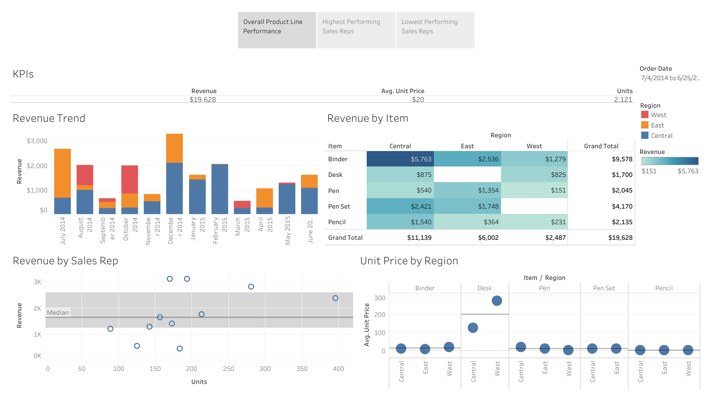
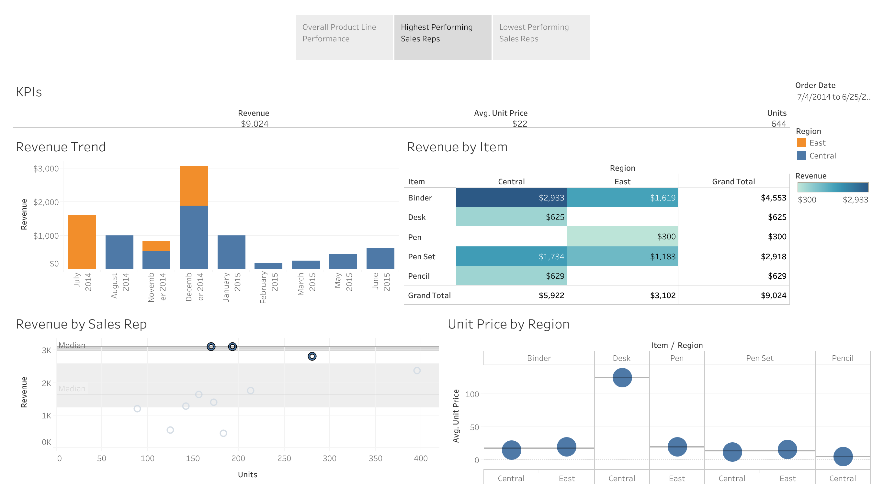
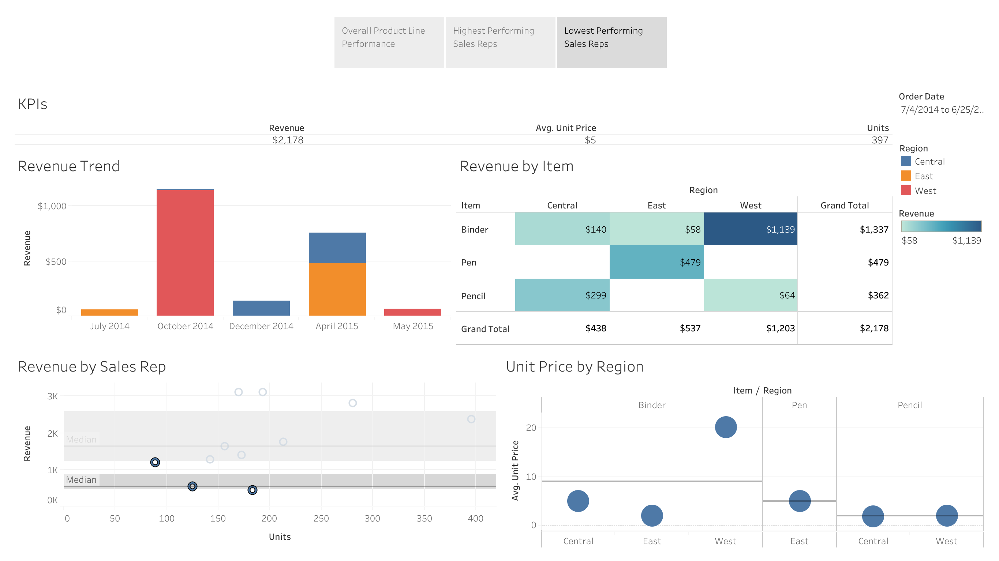

# Tableau Demo
Author: [Paul Lindquist](https://www.linkedin.com/in/paul-lindquist/)

## Objective
Used a simple dataset from Kaggle to visualize a dashboard in Tableau

## Data
An [office supply sales dataset](https://www.kaggle.com/fmendes/office-supply-sales?select=OfficeSupplies.csv) from Kaggle

## Methods
Defined 3 Key Performance Indicators (KPIs):
1. Units = Unit volume through each line of business
2. Unit Price = Sale price of unit sold
3. Revenue = \[Units]\*\[Unit Price]

Visualization method for each KPI:
1. Units: KPI
2. Unit Price: Comparison
3. Revenue: Trend, composition

## Dashboard
Live dashboard can be found on [Tableau Public](https://public.tableau.com/views/ProductLinePerformance_16436604645470/ProductLinePerformance?:language=en-US&publish=yes&:display_count=n&:origin=viz_share_link)

Overall product line performance

Filtered by highest performing sales reps

Filtered by lowest performing sales reps

